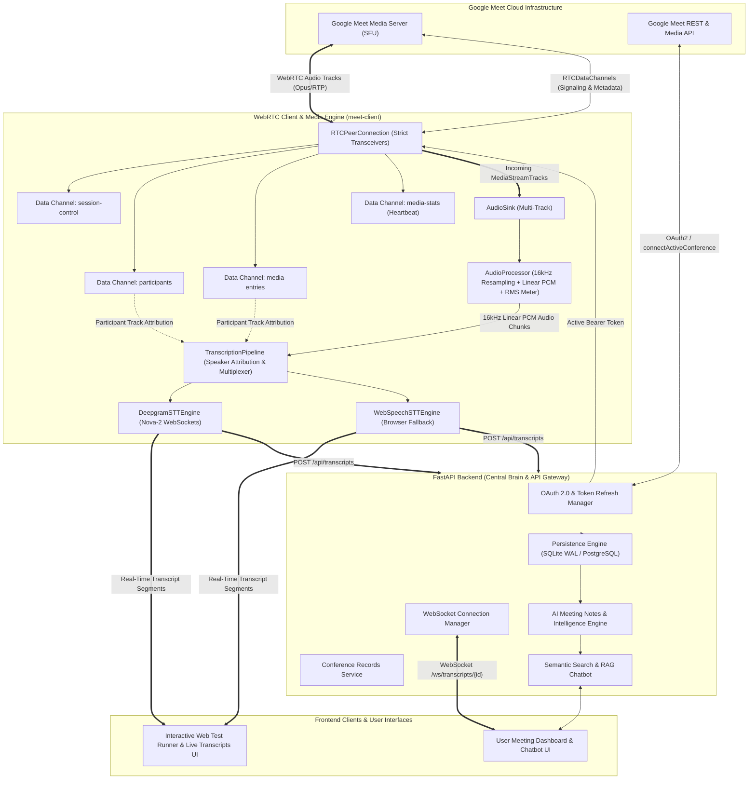
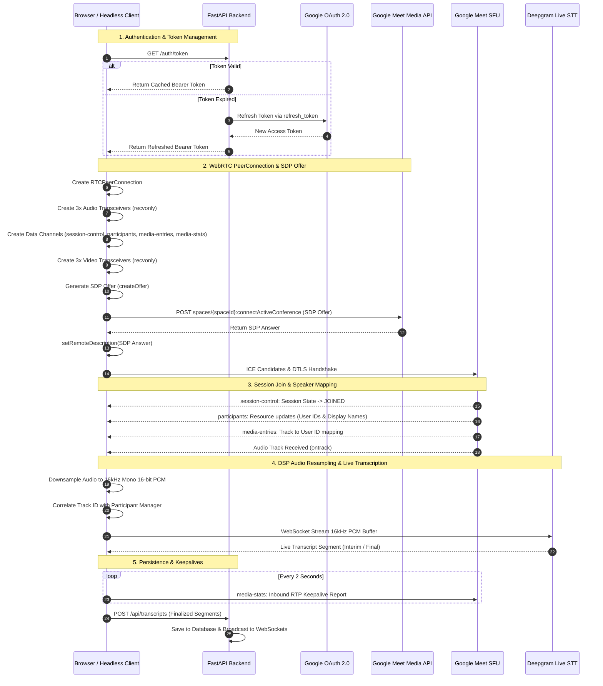
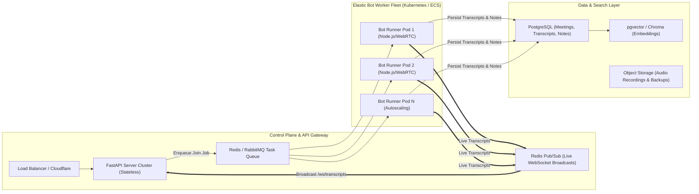

# Comprehensive System Architecture & Scaling Guide

This document provides a deep dive into the architecture of **`my-gmeet-bot`**, explaining **why each component was chosen**, **how data flows through the system**, and **how this design enables cost-effective, high-throughput horizontal scaling**.

---

## 1. High-Level System Architecture

The system is decoupled into an **Edge/WebRTC Ingestion Layer**, a **Streaming STT & Audio DSP Pipeline**, a **FastAPI Central Brain**, an **AI Intelligence/RAG Engine**, and an asynchronous **Persistence & WebSocket Broadcast Gateway**:



---

## 2. Signaling & WebRTC Media Connection Flow

The Google Meet Media API requires a precise, deterministic transceiver and data channel setup. The diagram below illustrates the exact lifecycle from authentication to active transcription:



---

## 3. Why We Chose This Architecture (Design Rationale)

| Architectural Choice | Why We Chose It | What We Avoided (Alternatives Considered) | Key Benefit |
| :--- | :--- | :--- | :--- |
| **Direct Google Meet Media API (WebRTC)** | Connects natively as a WebRTC peer directly to Google's SFU. Zero video rendering or screen capture overhead. | **Third-party bot vendors (Recall.ai, MeetingBaas)** which charge **$0.50 – $1.00/hour** per meeting. | **95%+ cost reduction**, complete data privacy, and sub-second latency. |
| **Data Channels for Speaker Attribution** | Google Meet provides deterministic track-to-participant metadata across WebRTC data channels (`participants` and `media-entries`). | **Acoustic Diarization / Voice Fingerprinting**, which is computationally heavy, error-prone, and struggles with overlapping speakers. | **100% accurate speaker names** without complex machine learning diarization pipelines. |
| **Client-Side DSP Resampling (`AudioProcessor`)** | Web Audio API ScriptProcessor/AudioWorklet resamples Float32 audio directly to 16kHz 16-bit Linear PCM in the client thread. | **Server-side `ffmpeg` transcoding**, which consumes huge CPU resources when decoding dozens of concurrent WebRTC streams. | **Zero server CPU spent on audio transcoding**. The client produces clean 16kHz PCM ready for any STT engine. |
| **Pluggable STT Engine Interface (`ISTTEngine`)** | Standardized interface for streaming PCM audio and receiving normalized `TranscriptSegment` objects. | **Hardcoded single-vendor STT**, which causes vendor lock-in and limits cost optimization. | Allows seamless switching between **Deepgram Nova-2** (low latency, high accuracy) and **Web Speech API** (zero-cost browser fallback). |
| **Periodic Keepalive Reporting (`MediaStatsHandler`)** | Collects inbound RTP stats and transmits structured keepalives across the `media-stats` channel every 2 seconds. | **Passive WebRTC listeners**, which Google Meet drops after 15–30 seconds due to `SESSION_UNHEALTHY` timeouts. | Guarantees stable, long-running meeting sessions without unexpected disconnects. |
| **FastAPI + SQLite WAL Mode (MVP) / PostgreSQL (Scale)** | SQLite with Write-Ahead Logging (WAL) allows concurrent reads and writes with zero external database server overhead. | **Complex distributed databases** for initial prototypes that increase operational overhead. | Instant zero-config setup, portable single-file database, with seamless migration path to PostgreSQL + pgvector. |

---

## 4. Scalability Blueprint: How This Architecture Scales

### A. Phase-by-Phase Load Comparison

```text
┌─────────────────────────┬───────────────────────────┬────────────────────────────┐
│         Metric          │   Phase 1-3 (Local Dev)   │ Phase 7 (Distributed Prod) │
├─────────────────────────┼───────────────────────────┼────────────────────────────┤
│ Concurrent Meetings     │ 1 – 5 meetings            │ 1,000+ concurrent meetings │
│ CPU per Meeting         │ ~5% of single core        │ ~0.1 vCPU (Headless Node)  │
│ Memory per Meeting      │ ~150 MB (Browser Tab)     │ ~80 MB (Optimized Worker)  │
│ Audio Bandwidth Inbound │ ~64 kbps (Opus Mono)      │ ~64 kbps (Opus Mono)       │
│ STT Audio Outbound      │ ~256 kbps (16kHz 16-bit)  │ ~256 kbps (16kHz 16-bit)   │
│ Ingestion Cost / Hour   │ $0.00 (Self-hosted)       │ ~$0.004 / bot hour (Cloud) │
└─────────────────────────┴───────────────────────────┴────────────────────────────┘
```

---

### B. Distributed Production Architecture (1,000+ Concurrent Meetings)

In production, meeting join requests are scheduled across a fleet of stateless, containerized worker nodes managed by a job queue:



---

### C. Scaling Pillars

1. **Stateless Bot Workers**:
   - Each meeting runner is isolated in a lightweight container.
   - If a meeting crashes or drops, it affects only that single meeting without impacting the rest of the cluster.
   - Kubernetes Horizontal Pod Autoscaler (HPA) scales worker pods based on active meeting queues in Redis.

2. **Decoupled Heavy AI Processing**:
   - STT is offloaded to specialized streaming hardware (e.g., Deepgram Nova-2 / Whisper API).
   - Post-meeting summaries and action-item extraction are processed asynchronously as background celery/fastapi tasks using Google Gemini 1.5 Pro/Flash, keeping the API fast and responsive.

3. **Multi-Tenant Real-Time Broadcasting**:
   - Redis Pub/Sub multiplexes live transcript streams across multiple API nodes, allowing thousands of dashboard users to view live transcripts concurrently without overloading individual database connections.

4. **Vector Retrieval & RAG Partitioning**:
   - Transcripts are chunked by speaker turn and indexed with vector embeddings (e.g., `text-embedding-004`).
   - Tenant-based partitioning ensures queries search only within the user's authorized meetings with exact timestamp citations.

---

## 5. Security, Privacy & Reliability

- **Token Isolation**: OAuth tokens and refresh credentials are stored with AES-256 encryption at rest and never exposed in public repositories or client-side bundles.
- **Strict Scope Boundaries**: Google Meet access is restricted to read-only conference media scopes (`meetings.space.readonly`, `meetings.conference.media.audio.readonly`).
- **Session Recovery**: Automated reconnection logic with exponential backoff on ICE disconnects and WebSocket reconnect handlers for uninterrupted transcription during transient network glitches.
